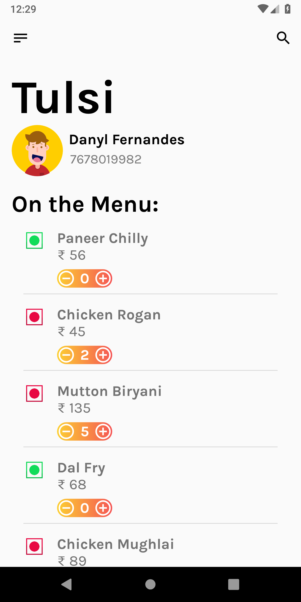
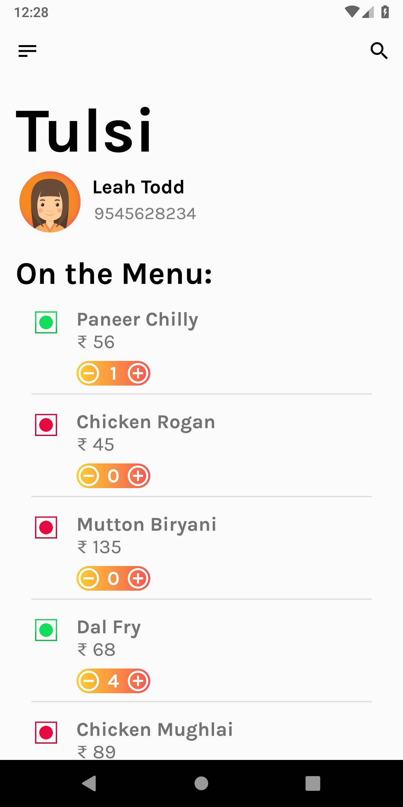

# Tulsi

* Tulsi is a food ordering application
* It uses modern UI/UX design guidelines to ensure customer satisfaction
* The user selects the food to order and the app will then generate a receipt

# Technical Info

* Built on MVP architecture to facilitate separation of business logic & testability.
* Uses best coding and architectural practices.
* Mockito for testing the Presenters and Interactors.

# Screenshots

  
  

# Dependencies

* <b>Support:</b> AppCompat, Design, ConstraintLayout

* <b>Database:</b> Firebase

* <b>Images:</b> CircleImageView

# Download

<a href="">Coming soon</a>
